# Module 1: Power Diodes and Rectifiers

## 1. Introduction

Power diodes are semiconductor devices designed for high current and voltage applications in power electronic circuits. This report examines diode characteristics, types, and rectification applications based on established literature [1][2][3].

Power electronics plays a fundamental role in modern electrical energy conversion systems. Among its core components, power diodes and rectifier circuits are essential for converting alternating current (AC) into direct current (DC) in both industrial and consumer applications. Power diodes are designed to handle high current and voltage levels, making them suitable for demanding environments such as motor control systems, power supplies, and renewable energy interfaces.

In particular, single-phase and three-phase rectifiers, composed of power diodes, allow efficient and reliable DC power delivery to various loads. The performance and behavior of these circuits depend greatly on the diode type—general-purpose, fast-recovery, or Schottky—and on how the system is designed to manage ripple, switching losses, and protection.

This report explores the electrical characteristics and functional roles of power diodes, their types, the concept of freewheeling operation, and the analysis and design of rectifier circuits. It also includes an overview of performance parameters, the behavior of RLC circuits in the presence of diodes, and final design considerations.

---

## 2. Power Diode Characteristics

Power diodes operate according to the Shockley equation [1]:

$$I_D = I_S \left( e^{\frac{V_D}{n V_T}} - 1 \right)$$

- **Forward-biased conduction:** Allows current when the anode is more positive than the cathode.
- **Reverse-blocking capability:** Withstands high reverse voltages up to breakdown (VRRM).
- **Reverse recovery time (trr):** Time required to stop conduction after polarity reversal.
- **Forward current capacity (IF):** Typically designed for >1 A continuous current.
- **Forward voltage drop (VF):** Between 0.7 V and 1.2 V, impacts conduction losses.
- **Thermal dissipation:** Requires heat sinks to manage power loss safely.

**Critical Parameters:**
- Maximum reverse voltage (V_RRM): 50V to 6kV
- Average forward current (I_F(AV)): 1A to several kA
- Reverse recovery time (t_rr): 25ns to 30μs
- Forward voltage drop (V_F): 0.7V to 1.5V

  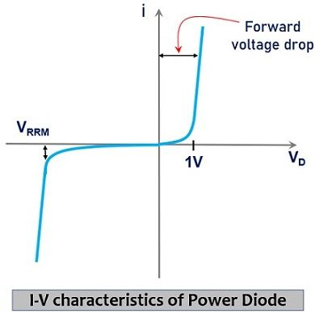
  
<i>Figure 1: Curva característica I-V de un diodo de potencia.</i>

---

## 3. Types of Diodes

**General-Purpose Diodes [1]:**
These diodes are used in low-frequency applications (50/60 Hz).  
- **Reverse recovery time:** Long (25–50 μs).  
- **Applications:** AC line rectifiers, battery chargers.  
- Not suitable for high-speed switching.

**Fast-Recovery Diodes [2]:**
Designed for medium to high-frequency circuits.  
- **Reverse recovery time:** Shorter (1–5 μs).  
- **Applications:** Inverters, DC–DC converters, and snubber circuits.  
- Reduces switching losses and EMI.

**Schottky Diodes [3]:**
Use a metal-semiconductor junction instead of a P–N junction.  
- **Forward voltage drop:** Low (0.3–0.5 V).  
- **Switching speed:** Very fast (nanoseconds).  
- **Applications:** High-speed, low-voltage circuits.  
- Limited reverse voltage (< 100 V) and higher leakage current.

  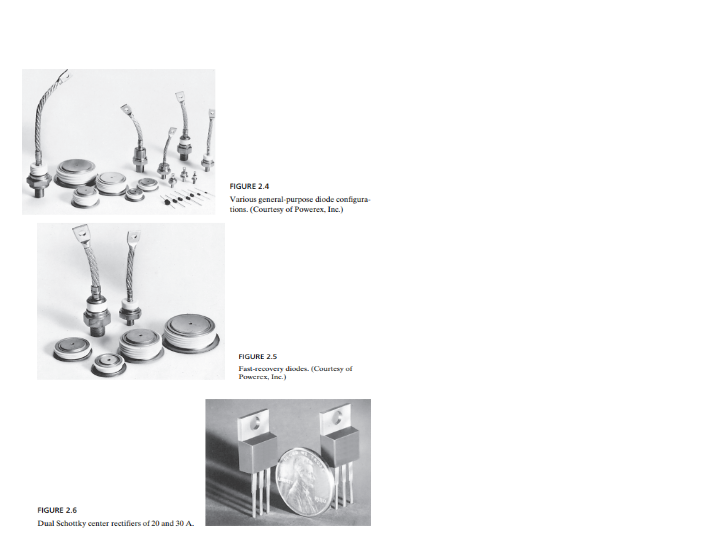
  
<i>Figure 2: Comparación de los tipos de diodos.</i>

---

## 4. Freewheeling Operation

Freewheeling diodes provide current continuity in inductive circuits when switches open, preventing voltage spikes [1].

**Operation Principle:**
- Inductor energy: $E_L = \frac{1}{2}LI^2$
- Current decay: $i_L(t) = I_0 e^{-\frac{R}{L}t}$
- Voltage limited to diode drop (~1V)

  In power electronics circuits with inductive loads (such as motors or coils), a freewheeling diode is connected in parallel with the load to provide a path for the inductive current when the main switching device (e.g., a transistor or thyristor) turns off.
[3]
- **Protect the circuit** from high-voltage transients caused by the sudden interruption of current through inductance.
- **Maintain current continuity** in the inductive load during the OFF period of the switch.
- **Reduce voltage spikes** across switching devices, enhancing reliability.

This operation is critical in DC chopper circuits, inverter-fed motors, and controlled rectifiers where inductive elements are present.

  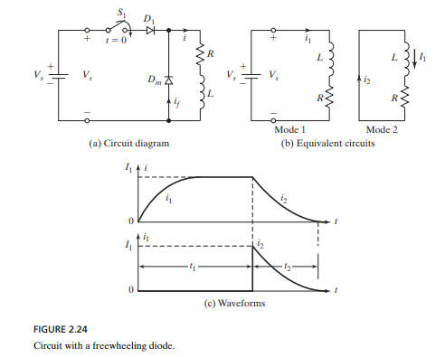
  
<i>Figure 3: Diodo de libre circulación en un circuito inductivo.</i>

---

## 5. Rectifiers with Diodes

### 5.1. Single-Phase Full-Wave Bridge Rectifier

Uses a four-diode bridge for efficient AC to DC conversion. It is a significant improvement over half-wave rectification as it uses the entire AC cycle.

- **Key Parameters:**
  - Average voltage: $V_{dc} = \frac{2V_m}{\pi} = 0.637 V_m$
  - Ripple factor: $RF = 0.482$ (without filter)
  - PIV per diode: $PIV = V_m$

- **Simulation Analysis:**
  - The simulations show the behavior of the full-wave rectifier. In Figure 4, the unfiltered output shows a pulsating DC waveform with significant ripple. In Figure 5, adding a filter capacitor drastically smooths the output, producing a nearly constant DC voltage, which is ideal for most electronic applications.

  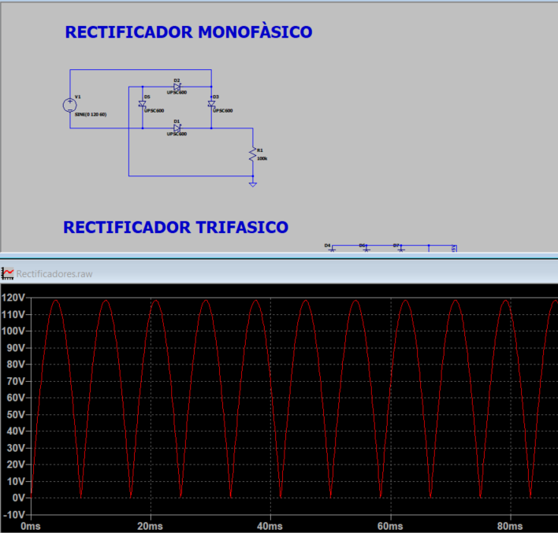
  
<i>Figure 4: Full-wave rectifier circuit and its unfiltered output.</i>

  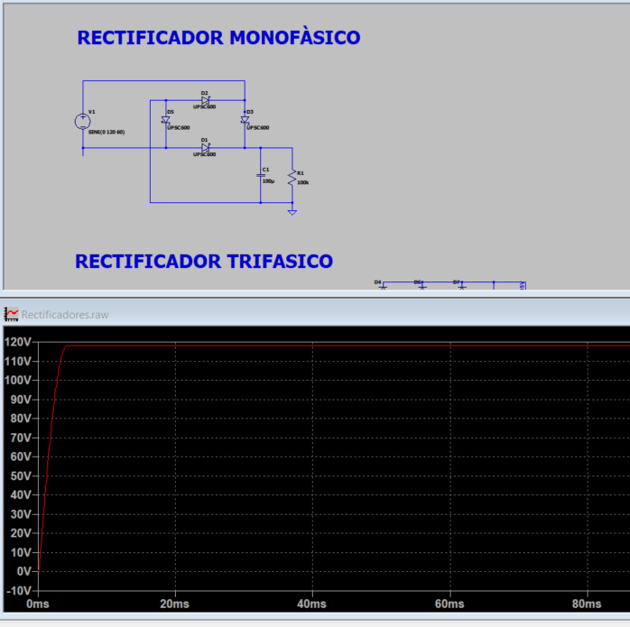
  
<i>Figure 5: Full-wave rectifier with filter capacitor and smoothed DC output.</i>

### 5.2. Three-Phase Full-Wave Bridge

A six-diode configuration that offers superior performance, ideal for industrial applications.
- **Key Parameters:**
  - Average voltage: $V_{dc} = \frac{3\sqrt{6}V_{LL}}{\pi} = 1.35 V_{LL}$
  - Ripple factor: $RF = 0.042$
  - PIV per diode: $PIV = \sqrt{3}V_{LL}$
- **Simulation Analysis:**
  - The simulations in Figures 6 and 7 show the complete three-phase rectification process. Figure 6 displays the balanced three-phase sources and the six-diode bridge. Figure 7 shows the resulting six-pulse DC output and how a filter capacitor smooths it to a nearly constant 120V DC.

  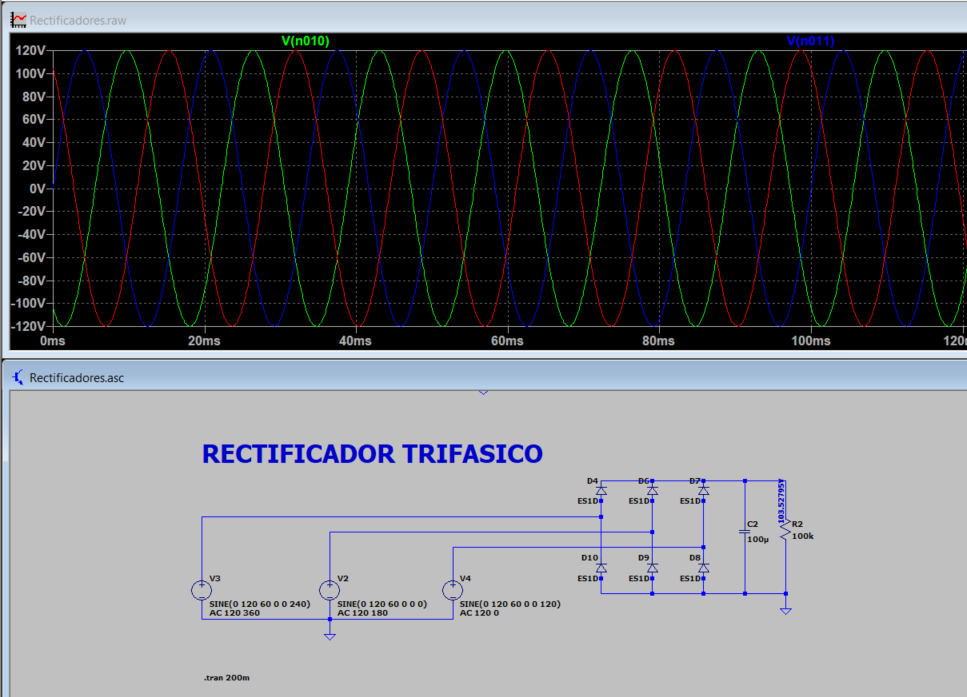
  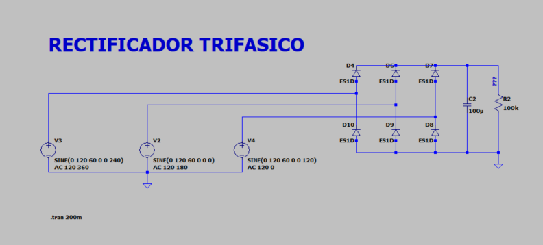
  
<i>Figure 6: Three-phase sources and rectifier circuit.</i>

  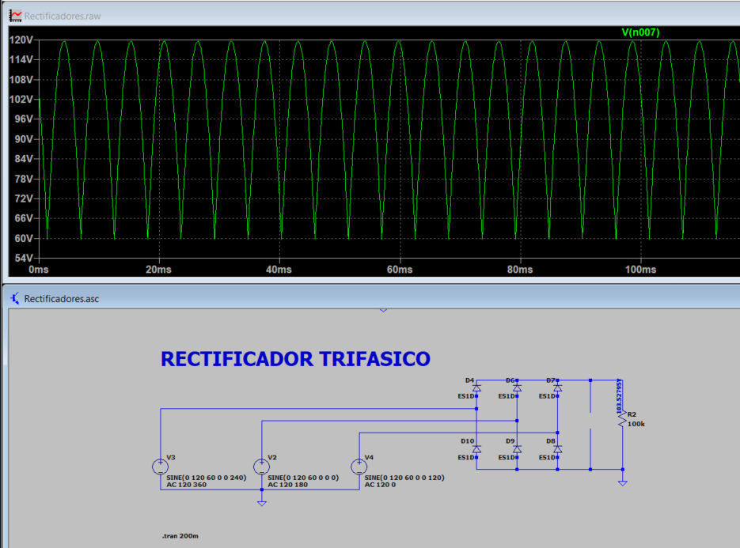
  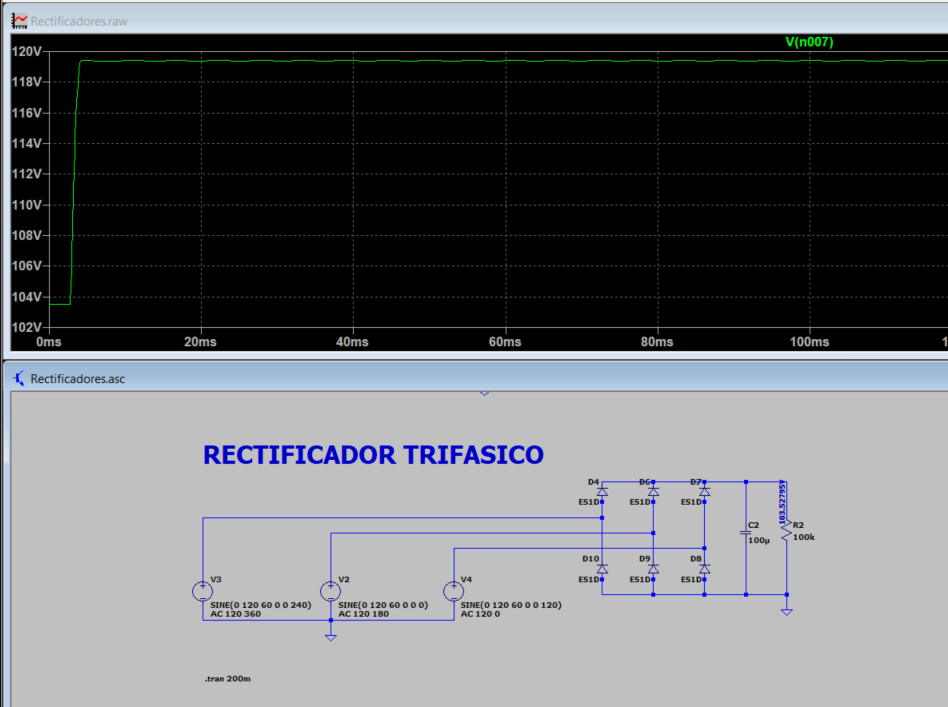
  
<i>Figure 7: Three-phase rectifier output waveforms.</i>

---

## 6. Performance Parameters

**Key Metrics [1][2]:**
- Efficiency: $\eta = \frac{P_{dc}}{P_{ac}}$
- Transformer Utilization Factor: $TUF = \frac{P_{dc}}{VA_{rating}}$
- Total Harmonic Distortion: $THD = \frac{\sqrt{\sum_{n=2}^{\infty} I_n^2}}{I_1}$

**Comparison:**
| Parameter | Single-Phase | Three-Phase |
|-----------|--------------|-------------|
| Ripple Factor | 0.482 | 0.042 |
| Efficiency | ~81% | ~95% |
| TUF | 0.812 | 0.955 |
**Average Output Voltage (Vdc)**
- Represents the DC level of the rectified output.
- For a single-phase full-wave rectifier:  
  Vdc = (2 × Vm) / π

**RMS Output Voltage (Vrms)**
- Useful for calculating power delivered to the load.

**Ripple Factor (r)**
- Indicates the amount of AC variation in the DC output.
- Defined as:  
  r = Vr(ac,rms) / Vdc  
- Lower ripple implies better DC quality.
- 
**Rectification Efficiency (η)**
- Ratio of DC power delivered to the load versus AC power from the source.
- Expressed as:  
  η = (Pdc / Pac) × 100%
**Form Factor (FF)**
- Ratio of Vrms to Vdc:  
  FF = Vrms / Vdc  
- Indicates waveform distortion

---

## 7. Rectifier Circuit Design

**Design Steps [1][3]:**
1. Determine load requirements (e.g., required DC voltage and current).
2. Select the appropriate rectifier topology (single-phase for simple applications, three-phase for industrial use).
3. Choose diodes with voltage and current ratings that are safely above the expected operating values.
4. Design a filter (usually a capacitor) to smooth the DC output and reduce ripple.

**Component Selection:**
- **Diode Voltage Rating:** Should be significantly higher than the Peak Inverse Voltage (PIV) to avoid breakdown.
- **Diode Current Rating:** Should be higher than the average DC load current.
- **Filter Capacitor:** The value is chosen to achieve the desired level of ripple in the output voltage.

**Design Example:**
For a simple 24V DC, 5A power supply from a 230V AC input:
- A full-wave bridge rectifier would be suitable.
- Diodes should be rated for a PIV well above 325V (the peak of 230V AC) and a current above 5A.
- A large capacitor would be needed to smooth the output.

---

## 8. RLC Circuit Behavior with Diodes

RLC circuits with diodes exhibit nonlinear behavior due to the switching nature of the diode. This is fundamental for applications like signal clipping and slicing.

**Diode Clipping Applications:**
Clipping circuits are used to limit the voltage of a signal to a certain level.
- **Simulation Analysis:**
  - The shunt clipper circuit is shown in Figure 8. The resulting waveforms in Figure 9 demonstrate how the positive and negative peaks of the signal are clipped at the desired voltage levels.

  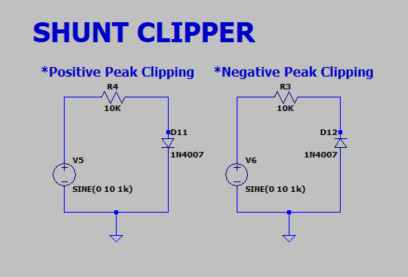
  
<i>Figure 8: Shunt clipper circuit.</i>

  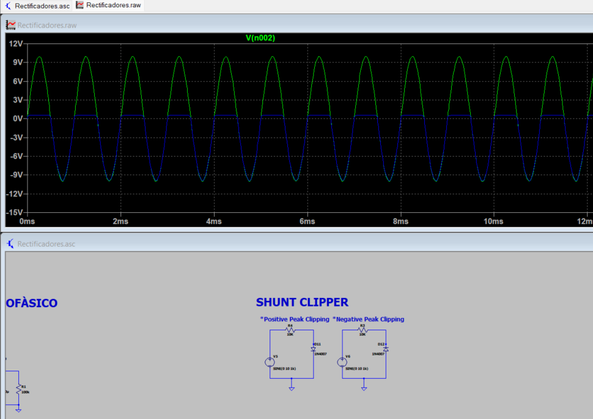
  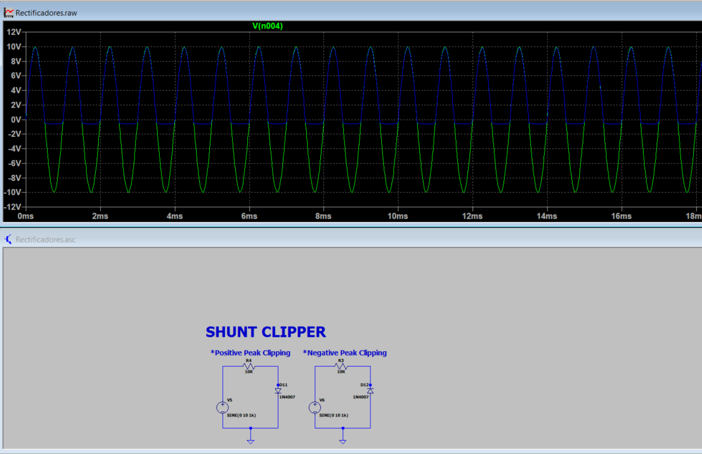
  
<i>Figure 9: Shunt clipper output waveforms.</i>

**Signal Slicing:**
Slicing circuits, or clippers, remove a part of the signal between two voltage levels.
- **Simulation Analysis:**
  - The slicer circuit and its output are shown in Figure 10. The waveform clearly shows the signal being "sliced," with the portion between the two reference voltages removed.

  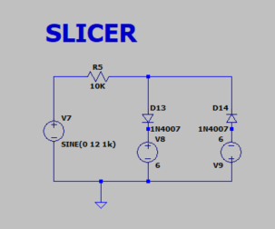
  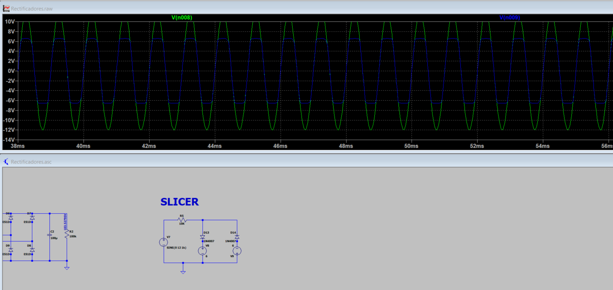
  
<i>Figure 10: Slicer circuit and output waveform.</i>

**Operating Modes:**
- **Diode ON:** The circuit behaves like a standard RLC circuit.
- **Diode OFF:** The current path is open, and the capacitor holds its voltage.

**Applications:** Resonant converters, energy transfer circuits, signal conditioning.

---

## 9. Simulations

All simulation files and resulting images are organized in the repository for review.

- **[Simulation Files](./simulation_files/):** Contains all LTSpice circuit files (.asc).
- **[Images](./images/):** Contains all output waveforms and plots.

---

## 10. Conclusions

Power diodes play a fundamental role in converting AC to DC in power electronic systems. Their selection—whether general-purpose, fast-recovery, or Schottky—depends on the operating frequency, voltage, and current requirements of the application. Freewheeling diodes are especially useful when working with inductive loads, as they help prevent voltage spikes and maintain current continuity when the main switch is turned off. Rectifiers built with diodes, either single-phase or three-phase, are widely used in industrial and electronic applications, and their performance is evaluated through parameters like average output voltage, ripple, and efficiency. A proper rectifier design considers diode ratings, filtering components, and protection elements such as heat sinks and fuses. Understanding the behavior of RLC loads in these circuits also helps improve stability and overall system performance.

Power diodes are essential components in power electronics with distinct characteristics for different applications:
- **Diode Selection:** General-purpose for low-frequency, fast-recovery for switching, Schottky for high-efficiency applications
- **Rectifier Performance:** Three-phase systems offer superior performance (4.2% vs 48.2% ripple)
- **Design Considerations:** Safety margins and thermal management are critical
- **Future Trends:** SiC and GaN technologies enable higher frequency and efficiency

---

## References

[1] Erickson, R. W., & Maksimović, D. (2001). *Fundamentals of Power Electronics* (2nd ed.). Springer.

[2] Mohan, N., Undeland, T. M., & Robbins, W. P. (2003). *Power Electronics: Converters, Applications, and Design* (3rd ed.). Wiley.

[3] Rashid, M. H. (2017). *Power Electronics: Devices, Circuits, and Applications* (4th ed.). Pearson.
