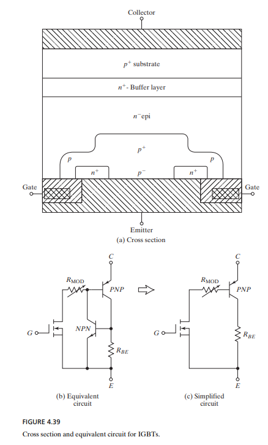
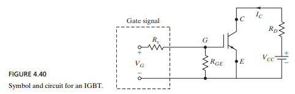
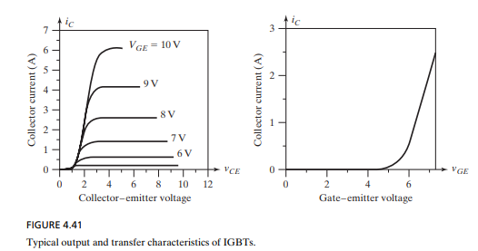
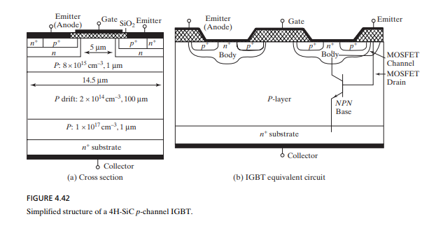

# Module 2: Power Transistors

This document covers the theoretical and practical aspects of power transistors, focusing on MOSFETs, BJTs, and IGBTs. The content is primarily based on Chapter 4 of "Power Electronics" by Rashid, with complementary information from Mohan.

## 1. Introduction to Power Transistors

*(Based on Rashid, Chapter 4.1 & 4.2)*

A brief overview of power transistors, their importance in power electronics, and an introduction to different types like Silicon Carbide transistors.

## 2. Power MOSFETs

*(This section is to be completed by the team member assigned to MOSFETs).*

This section details the operation, characteristics, and applications of Power MOSFETs.

### 2.1. Operating Principle

*(Based on Rashid, Chapter 4.3)*

Power MOSFETs (Metal-Oxide-Semiconductor Field-Effect Transistors) are voltage-controlled solid-state devices that function as switches. The key to their operation lies in the field-effect: a voltage applied to the gate (`G`) creates an electric field that modulates the conductivity of a channel between the drain (`D`) and the source (`S`). Unlike BJTs, their high input impedance means they require very little gate current for control.

#### 2.1.1. Cut-off and Saturation Regions
Detailed analysis of how Power MOSFETs operate as switches, focusing on their behavior in the cut-off (off-state) and saturation (on-state) regions.

* **Cut-off Region ("OFF" State):** When the gate-to-source voltage ($V_{GS}$) is less than the threshold voltage ($V_{th}$), the conductive channel is not formed. The drain current ($I_D$) is practically zero, and the device behaves as an **open switch** with very high resistance.
* **Saturation Region ("ON" State):** This is the key point Rashid clarifies. While saturation is used for amplification in analog electronics, power MOSFETs operate in the **linear or ohmic region** for the "ON" state. As $V_{GS}$ increases above $V_{th}$, the channel becomes highly conductive, and the resistance between the drain and source ($R_{DS(on)}$) is minimized. The device behaves as an ideal **closed switch**, with very low conduction losses ($P = I_D^2 \cdot R_{DS(on)}$). The "saturation" region of the characteristic curves is avoided to prevent excessive power dissipation.

---

### 2.2. Characteristics

*(Based on Rashid, Chapter 4.3.1 & 4.3.2)*

* **Steady-State Characteristics:** Analysis of the output and transfer characteristics.
  * **Output Characteristics ($I_D$ vs. $V_{DS}$):** Show how the drain current changes with the drain-to-source voltage for different $V_{GS}$ values. This defines the three operating regions (cutoff, linear/ohmic, and saturation).
  * **Transfer Characteristics ($I_D$ vs. $V_{GS}$):** Relate the drain current to the gate voltage. It shows that current only begins to flow when $V_{GS}$ exceeds the threshold voltage ($V_{th}$), a key parameter for control circuit design.

* **Switching Characteristics:** Turn-on time, turn-off time, and factors affecting switching speed.
  * **Switching Times:** The turn-on time ($t_{on}$) and turn-off time ($t_{off}$) of the MOSFET are extremely short, which allows for their use in high-frequency applications. These times are primarily determined by the charging and discharging of the device's internal capacitances (especially $C_{gs}$ and $C_{gd}$) through the gate resistance.
  * **Switching Losses:** Power losses occur not only in the "ON" state but also during the transition from "ON" to "OFF" and vice versa. These losses are proportional to the switching frequency.
---

### 2.3. Types of MOSFETs (Further Research)
* **N-Channel and P-Channel MOSFETs:** Most power MOSFETs are N-channel due to the higher mobility of electrons compared to holes in silicon, resulting in a lower $R_{DS(on)}$.
* **Planar and Trench Technology:** Trench designs are more modern and compact, allowing for a higher cell density on the chip. This significantly reduces the on-state resistance ($R_{DS(on)}$) compared to planar designs.
* **SiC and GaN MOSFETs:** These next-generation transistors, based on Silicon Carbide (SiC) and Gallium Nitride (GaN), offer superior properties. They have higher breakdown voltages, lower on-state resistance, and much faster switching capability than their silicon counterparts. They are ideal for high-frequency and high-power applications.

#### 2.3.1. N-Channel vs. P-Channel

An investigation into which type (N-Channel or P-Channel) is more commonly used in power applications and the reasons why.

#### 2.3.2. NMOS, PMOS, and CMOS

A brief description of NMOS, PMOS, and CMOS technologies and their typical applications.

### 2.4. Simulation

A basic simulation of a MOSFET circuit to switch a load (e.g., a light bulb).

- **Tool:** Qspice (or LTspice).
- **Objective:** Analyze the switching behavior.
- **Parameters to measure:** Heat (power dissipation), efficiency, turn-on time, and turn-off time.

## 3. Bipolar Junction Transistors (BJTs)

*(This section is to be completed by the team member assigned to BJTs).*

This section details the operation, characteristics, and applications of Power BJTs. The primary component for analysis and simulation will be the **TIP3055** power transistor.

### 3.1. Operating Principle

*(Based on Rashid, Chapter 4.6)*

A bipolar junction transistor (BJT) is created by adding a second p- or n-type region to a pn-junction diode, forming two junctions: the base–emitter junction (BEJ) and the collector–base junction (CBJ). Depending on the arrangement of the layers, an NPN transistor consists of two n-regions and one p-region, while a PNP transistor consists of two p-regions and one n-region. The three external terminals of a BJT are the collector (C), the emitter (E), and the base (B).

### 3.2. Characteristics

*(Based on Rashid, Chapter 4.6.1, 4.6.2 & 4.6.3)*
- **Steady-State Characteristics**
  - A transistor operates in three distinct regions: cutoff, active, and saturation.
  -	In the cutoff region, both junctions are reverse biased, the base current is too small to turn the transistor on, and the device remains off.
  -	In the active region, the transistor behaves as an amplifier: the base current is amplified by the forward current gain βF, the CBJ is reverse  biased, and the BEJ is forward biased.
  - In the saturation region, both junctions are forward biased, the base current is sufficiently large, and the transistor acts as a switch with low VCE. Saturation is reached when further increases in base current no longer significantly increase the collector current.
- **Switching Characteristics:**
  - During delay time (td): the base–emitter junction capacitance must charge to about 0.7 V before any collector current flows.
  -	During rise time (tr): the collector current increases to its steady-state value, determined by the BEJ capacitance.
  -	In saturation: excess base current causes extra minority carrier charge storage in the base, called saturating charge Qs, which depends on the overdrive factor (ODF).
  -	During storage time (ts): the stored charge must be removed from the base before the transistor can turn off. A reverse base current accelerates this process.
  -	During fall time (tf): the collector current decreases to zero, controlled by the reverse-biased BEJ capacitance.
- **Switching Limits:**
  - **Second Breakdown (SB):**
    -	Destructive phenomenon caused by current concentration in a small portion of the base.
    -	Produces hot spots and may damage the transistor due to thermal runaway.
    -	Depends on the combination of voltage, current, and time → energy-dependent phenomenon.
  - **Forward-Biased Safe Operating Area (FBSOA):**
    -	Applies during turn-on and conduction state.
    -	Limited by average junction temperature and the risk of SB.
    -	Defines the safe IC-VCE limits for reliable operation.
  - **Reverse-Biased Safe Operating Area (RBSOA):**
    -	Applies during transistor turn-off.
    -	The device sustains both high current and voltage with the BEJ reverse biased.
    -	VCE must be kept at a safe level for the given IC.
  - **Breakdown Voltages:**
    -	Maximum voltage between two terminals with the third terminal open, shorted, or biased.
    -	At breakdown, the voltage remains nearly constant while the current rises rapidly.
    -	Manufacturers specify different breakdown values depending on test conditions.

### 3.3. Types and Configurations (Further Research)

#### 3.3.1. NPN vs. PNP

An investigation into which type (NPN or PNP) is more commonly used in power applications and the reasons for it.

#### 3.3.2. BJT Configurations

A summary of the main BJT configurations and their primary use cases:
- Common Emitter
- Common Collector
- Common Base

### 3.4. Simulation

A basic simulation of a BJT circuit to switch a load (e.g., a light bulb), as described in [this tutorial](https://www.electronics-tutorials.ws/transistor/tran_4.html), but adapted for the TIP3055 Power BJT.

- **Tool:** Qspice (or LTspice).
- **Objective:** Analyze the switching behavior.
- **Parameters to measure:** Heat (power dissipation), efficiency, turn-on time, and turn-off time.

## 4. Insulated Gate Bipolar Transistors (IGBTs)

*(Based on Rashid, Chapter 4.7)*

The Insulated Gate Bipolar Transistor (IGBT) merges the primary benefits of Bipolar Junction Transistors (BJTs) and Metal-Oxide-Semiconductor Field-Effect Transistors (MOSFETs). It features the high input impedance of a MOSFET, allowing for simpler gate drive circuits, combined with the low on-state conduction losses characteristic of a BJT. This makes it highly efficient for high-current applications. Unlike BJTs, IGBTs are not prone to secondary breakdown.

The device's internal structure consists of four alternating PNPN layers. While this structure is inherently susceptible to latch-up, modern designs incorporate features to prevent this phenomenon. Two primary IGBT structures exist:
- **Punch-through (PT):** Utilizes a heavily doped n+ buffer layer to reduce switching times.
- **Non-punch-through (NPT):** Optimizes carrier lifetime in the drift region to lower the on-state voltage drop.

As a voltage-controlled device, the IGBT's operation is similar to that of a power MOSFET. A positive voltage applied between the gate and emitter terminals turns the device on, creating a channel for current flow. Removing this gate voltage turns the device off. While their switching speed is generally lower than that of MOSFETs, IGBTs offer superior robustness and current-handling capabilities compared to BJTs, making them suitable for medium-to-high power applications such as motor drives, power supplies, and solid-state relays.

### 4.1. Structure and Operation

The physical structure and equivalent circuit models provide insight into the IGBT's behavior.

  
  
<i>Figure 4.39: Cross-section and equivalent circuit of an IGBT.</i>

- **(a) Cross-Section:** The diagram shows the IGBT's layered structure, with a p+ substrate (Collector), an n+ buffer layer, and an n- drift region. The gate structure, insulated by a silicon oxide layer, controls conductivity in the p-body region.
- **(b) Equivalent Circuit:** The IGBT can be modeled as a Darlington configuration comprising an N-channel MOSFET, an NPN BJT, and a PNP BJT. The MOSFET controls the base current of the NPN BJT, which in turn drives the main PNP BJT, highlighting the device's hybrid nature.
- **(c) Simplified Circuit:** A more straightforward model shows the essential components: an N-channel MOSFET driving a PNP BJT.

  
  
<i>Figure 4.40: IGBT symbol and basic circuit.</i>

The standard schematic symbol for an IGBT combines elements from both MOSFET and BJT symbols. The figure also shows a typical switching circuit where the IGBT controls current flow through a resistive load `RD`.

### 4.2. Characteristics

The electrical behavior of an IGBT is defined by its output and transfer characteristics.

  
  
<i>Figure 4.41: Typical output and transfer characteristics of an IGBT.</i>

- **(a) Output Characteristics:** This graph plots collector current (`IC`) versus collector-emitter voltage (`VCE`) for various gate-emitter voltages (`VGE`). As `VGE` increases beyond the threshold, the IGBT turns on, allowing significant current flow with a low on-state voltage drop.
- **(b) Transfer Characteristics:** This curve shows the relationship between `IC` and `VGE`. The device begins to conduct significantly once `VGE` surpasses the threshold voltage (`VGE(th)`), which is around 6V in this example.

### 4.3. Silicon Carbide (SiC) IGBTs

Silicon Carbide (SiC) has emerged as a superior material for power devices, leading to the development of SiC IGBTs for high-power applications.

- **Performance:** SiC IGBTs offer higher blocking voltages (up to 10 kV), lower on-state resistance, and reduced switching losses compared to their silicon counterparts.
- **Applications:** Their high-speed switching capability makes them ideal for high-frequency, high-power systems.

  
  
<i>Figure 4.42: Simplified structure of a 4H-SiC p-channel IGBT.</i>

The cross-section of a SiC IGBT shows a structure optimized for high performance. The layer design, including thickness and doping levels, is engineered to achieve the desired voltage and current ratings.

### 4.4. Simulation

A basic simulation of an IGBT circuit to switch a load.

- **Tool:** Qspice (or LTspice).
- **Objective:** Analyze the switching behavior.
- **Parameters to measure:** Heat (power dissipation), efficiency, turn-on time, and turn-off time.

## 5. Project Plan & General Notes

- **Rectifier:** The previously designed rectifier will be used as the input stage for the power transistor circuits.
- **Documentation:** This document, along with simulation files, will be part of the project deliverables. A video demonstrating the simulation results is recommended.
- **Timeline:**
  - **Week of Aug 25-29:** Theoretical review and start of simulations.
  - **Following weeks:** DC-DC converters and physical implementation.
