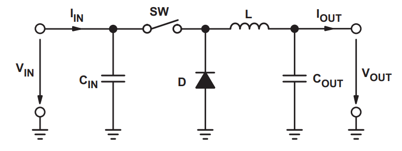
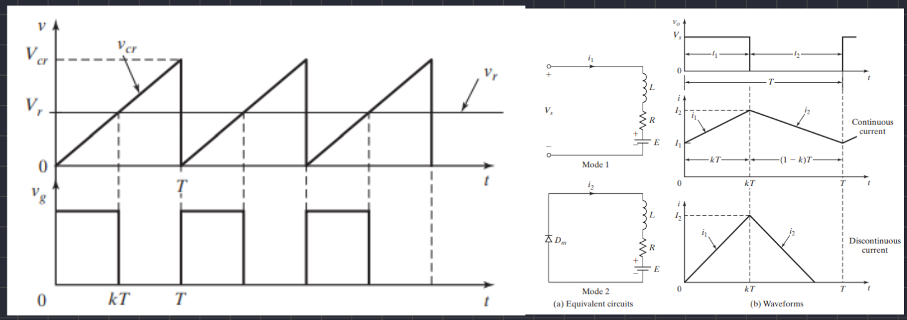
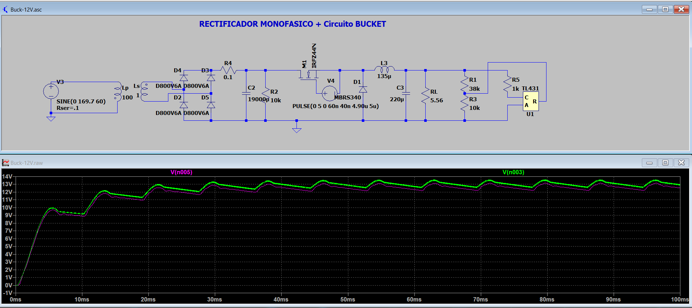
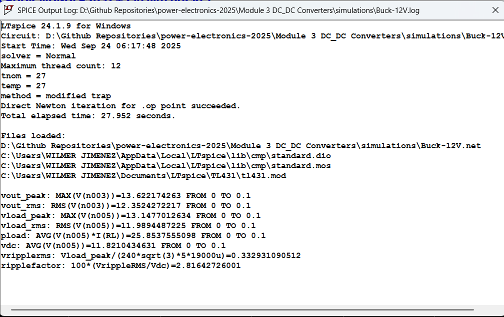

# Module 3: DC-DC Converters

This document covers the theoretical and practical aspects of DC-DC converters, focusing on Buck converters, their design principles, and applications in power electronics systems.

## 1. Introduction to DC-DC Converters

DC-DC converters are fundamental components in modern power electronics, enabling efficient transformation of direct current voltage levels through rapid switching techniques. These circuits are essential for power management in electronic systems where the available power source voltage differs from what is required by the load.

Among various topologies, the Buck converter (step-down converter) represents one of the most widely used configurations for reducing DC voltages while maintaining high energy efficiency. Its simplicity and effectiveness make it ideal for a wide range of applications, from mobile devices to industrial power systems.

---

## 2. Buck Converter Fundamentals

### 2.1. Definition and Operating Principle

A Buck converter is an electronic device that converts a fixed DC input voltage (Vin) to a lower DC output voltage (Vout) using Pulse Width Modulation (PWM) to control a power switch. The fundamental principle is based on rapidly switching the input voltage, where the output voltage is obtained as the time average of the applied PWM signal.

The converter operation is characterized by two main states:
- **ON state**: When the switch is closed, energy transfers directly from the input to the load while the inductor stores energy
- **OFF state**: When the switch is open, the inductor releases its stored energy to the load through the freewheeling diode

### 2.2. Key Parameters

The mathematical analysis of Buck converters involves several fundamental parameters:

- **Vin**: Input voltage (V)
- **Vout**: Output voltage (V)  
- **D**: Duty cycle, dimensionless (0 < D < 1)
- **T**: Switching period (s)
- **fs**: Switching frequency (Hz), where fs = 1/T
- **L**: Filter inductor value (H)
- **C**: Filter capacitor value (F)

  
  
<i>Figure 1: Basic Buck converter circuit showing main components: power switch, freewheeling diode, inductor, and output capacitor.</i>

---

## 3. Mathematical Analysis

### 3.1. Output Voltage Relationship

The fundamental equation that defines the Buck converter's steady-state behavior establishes that the average output voltage is directly proportional to the input voltage and the duty cycle:

$$V_{out} = D \times V_{in}$$

This relationship implies the characteristic operating conditions of the Buck converter:
- 0 < D < 1 (the duty cycle must be less than unity)
- 0 < Vout < Vin (the output voltage is always lower than the input voltage)

### 3.2. Inductor Design

The inductor design is a critical element that directly affects system efficiency, output voltage ripple (ΔVout), and control loop stability. The inductance calculation is based on limiting the current ripple through the inductor during operation.

The formula for calculating the required inductance is:

$$L = \frac{(V_{in} - V_{out}) \times D}{\Delta I_L \times f_s}$$

Where:
- **ΔIL**: Peak-to-peak inductor current ripple (A)
- **D**: Duty cycle = Vout/Vin

The current ripple is typically defined as a percentage of the output current (usually between 20% and 40%):

$$\Delta I_L = r \times I_{out}$$

Where **r** is the current ripple ratio (typically 0.2 to 0.4).

### 3.3. Practical Design Example

For the specific laboratory case with the following parameters:
- Light bulb power: P = 21 W
- Input voltage: Vin = 13-15 V (average 13.5 V)
- Desired output voltage: Vout = 12 V
- Output current: Iout = 1.75 A
- Switching frequency: fs = 31.25 kHz
- Desired current ripple: 30% of Iout

**Duty cycle calculation:**
D = Vout/Vin = 12/13.5 = 0.889

**Current ripple calculation:**
ΔIL = 0.30 × 1.75 A = 0.525 A

**Inductance calculation:**
L = (13.5 - 12) × 0.889 / (0.525 × 31,250) = 81.3 μH

This value can be adjusted considering practical factors such as component tolerances and operating conditions.

### 3.4. Efficiency Relationships

Under ideal conditions, the efficiency of a Buck converter approaches unity (ηc ≈ 1) because the conversion is performed using reactive elements rather than resistive ones. However, in practice, conduction and switching losses reduce typical efficiency to values between 85% and 95%.

The transformation ratios are defined as:
- **RFv = Vout/Vin**: Voltage ratio
- **RFi = Iout/Iin**: Current ratio

  
  
<i>Figure 2: PWM signals with different duty cycles and the resulting output voltages.</i>

---

## 4. Circuit Components

### 4.1. Main Elements

The basic Buck converter consists of the following elements:

1. **Power Switch (Sw)**: Typically a power MOSFET controlled by PWM
2. **Freewheeling Diode (D)**: Allows current circulation when the switch is open
3. **Inductor (L)**: Stores energy and smooths the output current
4. **Output Capacitor (C)**: Filters the output voltage, reducing ripple
5. **Load Resistance (R)**: Represents the load connected to the converter

### 4.2. MOSFET Driver TC4427

The TC4427 is a high-speed dual MOSFET driver specifically designed for power switching applications. Its main features include:

- Peak output current: 1.5 A per driver
- Supply voltage range: 4.5 V to 18 V
- Capacitive load handling: 1000 pF in 25 ns
- Short delay times: < 40 ns typical
- Low output impedance: 7 Ω typical
- Electrostatic discharge protection: 2.0 kV

The TC4427 configuration provides two non-inverting outputs, making it ideal for controlling MOSFETs in Buck converters where fast and precise switching is required.

  
  
<i>Figure 3: TC4427 MOSFET driver pinout diagram with typical connections.</i>

---

## 5. Waveforms and Dynamic Behavior

### 5.1. Control Signals

The Buck converter operates using a square PWM signal applied to the power switch. During the on-time (ton), the voltage across the inductor is positive, causing a linear increase in current. During the off-time (toff), the voltage reverses and the current decreases linearly.

### 5.2. Filtering and Stabilization

The LC filter at the converter output transforms the rectangular PWM signal into a stable DC voltage with minimal ripple. The time constant of the LC filter determines the transient response and output voltage quality.

  
  
<i>Figure 4: Inductor current waveform showing characteristic ripple during switching cycles.</i>

---

## 6. Comparison with Linear Regulators (LDOs)

### 6.1. Efficiency and Power Dissipation

Linear regulators (LDOs) operate by dissipating excess voltage as heat, resulting in typical efficiencies of 60-70% when there is a significant difference between input and output voltages. In contrast, Buck converters achieve efficiencies of 80-95% by using reactive elements for energy storage and transfer.

### 6.2. Comparative Characteristics

The selection between Buck converters and LDOs depends on several factors:

**Buck Converters:**
- High efficiency (80-95%)
- High power handling capability
- Switching noise generation
- Greater design complexity
- Higher cost due to additional components

**LDO Regulators:**
- Simple implementation
- Low noise and output ripple
- Fast transient response
- Efficiency limited by thermal dissipation
- Ideal for low power and low noise applications

  
  
<i>Figure 5: Efficiency comparison between Buck converters and LDO regulators at various input-output voltage differentials.</i>

---

## 7. Practical Applications

Buck converters find application in various technological sectors:

- **Switched-mode power supplies**: Power systems for electronic equipment
- **Battery chargers**: Especially in portable devices and electric vehicles
- **Renewable energy systems**: Power conditioning in solar panels
- **Voltage regulation in microprocessors**: Conversion from bus voltages to core voltages
- **Motor control**: Speed regulation through voltage control

---

## 8. Design Considerations

### 8.1. Component Selection

Optimal design of a Buck converter requires careful component selection considering:

1. **Inductor saturation current**: Must be higher than the peak current
2. **Inductor DC resistance**: Minimize conduction losses  
3. **MOSFET breakdown voltage**: Must withstand maximum input voltage
4. **MOSFET continuous current**: Must handle maximum output current
5. **Capacitor capacitance and ESR**: Determines output voltage ripple

### 8.2. Stability and Control

Control loop stability is a critical aspect requiring analysis of the system transfer function and appropriate compensation to ensure stable response to load and line variations.

---

## 9. Simulations and Implementation

  
  
<i>Figure 6: Practical implementation of the Buck converter circuit.</i>

  
  
<i>Figure 7: Oscilloscope capture showing switching signals and output voltage.</i>

  
  
<i>Figure 8: Simulation results showing key waveforms of the Buck converter.</i>

  
  
<i>Figure 9: Comprehensive simulation results with performance metrics.</i>

---

## 10. Conclusions

The Buck converter represents an efficient and versatile solution for DC voltage reduction applications, offering significant advantages in terms of energy efficiency compared to linear solutions. Understanding its operating principles, mathematical analysis, and design considerations is fundamental for successful implementation in modern power systems. The integration of specialized drivers like the TC4427 facilitates precise switching control, contributing to the optimization of overall system performance.

---

## References

[1] Erickson, R. W., & Maksimović, D. (2001). *Fundamentals of Power Electronics* (2nd ed.). Springer.

[2] Mohan, N., Undeland, T. M., & Robbins, W. P. (2003). *Power Electronics: Converters, Applications, and Design* (3rd ed.). Wiley.

[3] Rashid, M. H. (2017). *Power Electronics: Devices, Circuits, and Applications* (4th ed.). Pearson.

[4] Hart, D. W. (2010). *Power Electronics*. McGraw-Hill.

[5] Microchip Technology Inc. (2007). *TC4427/TC4428 Data Sheet*.

[6] Texas Instruments. (2019). *Fundamentals of Low Dropout (LDO) Linear Regulators*.

[7] Ridley, R. B. (2006). *Power Supply Design: Inductor Design Methods*.

[8] Brown, M. (2007). *Power Sources and Supplies: World Class Designs*. Newnes.

[9] Rincon-Mora, G. A. (2009). *Analog IC Design with Low-Dropout Regulators (LDOs)*.

[10] Kazimierczuk, M. K. (2008). *Pulse-Width Modulated DC-DC Power Converters*. Wiley.